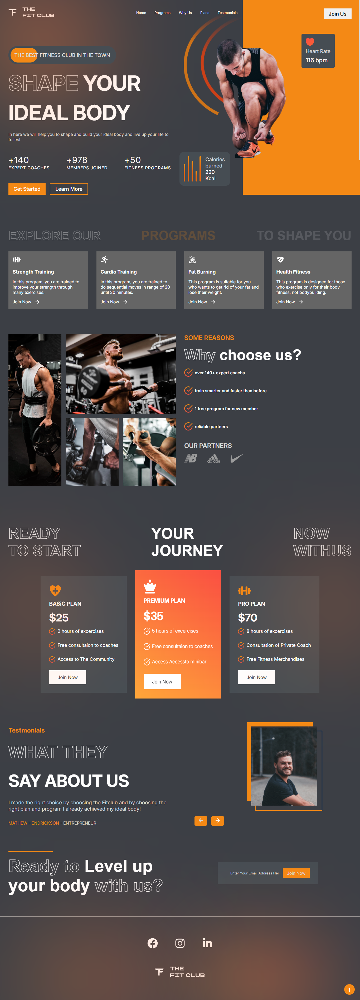
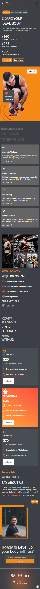

 # 🏋️‍♂️ Gym Website

## 📌 Description
A modern and responsive **Gym & Fitness website** built with **React.js** and **Vite**.  
The website is designed to showcase gym services, membership plans, and contact information with a clean UI and smooth animations.  
It features animated counters, interactive elements, and an integrated email form for contacting the gym directly.

---

## 🚀 Features
- 💪 Modern, responsive design suitable for all devices.
- 🎯 Smooth animations using **Framer Motion**.
- 🔢 Animated counters for displaying stats using **React CountUp**.
- 📧 Contact form with **EmailJS** integration.
- 🎨 Icons from **React Icons** for a visually appealing interface.

---

## 🛠️ Tech Stack
- **Frontend:** [React.js](https://react.dev/) + [Vite](https://vitejs.dev/)
- **Styling:** CSS
- **Animations:** [Framer Motion](https://www.framer.com/motion/)
- **Icons:** [React Icons](https://react-icons.github.io/react-icons/)
- **Counters:** [React CountUp](https://www.npmjs.com/package/react-countup)
- **Email Handling:** [EmailJS](https://www.emailjs.com/)

---

 📂 Project Structure
 
gym/

│── public/

│── src/

│   ├── assets/        # Images, icons, and static files

│   ├── components/    # Reusable UI components 

│   ├── App.jsx

│   ├── main.jsx

│── package.json

│── vite.config.js 

----
## Screenshots
### Home Page

### Phone Home Page

---
⚡ How to Run Locally
git clone https://github.com/your-username/gym-website.git

cd gym
npm i 
npm run dev 
---
 

